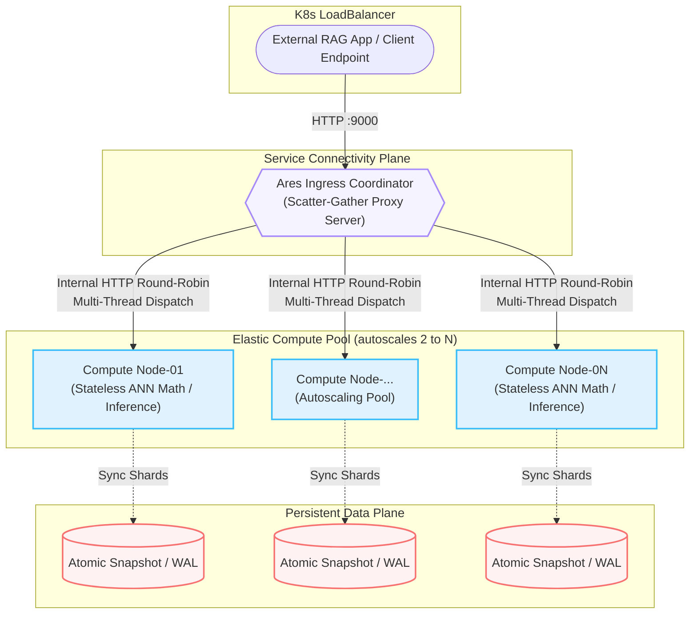

<div align="center">

# Project Ares
**Disaggregated Cloud-Native Vector Search Engine & AI Memory Backend**

[](#)
[](#)
[](#)
[](#)

*A resilient, horizontally scalable vector database engineered with separated compute & storage capabilities for enterprise Retrieval-Augmented Generation (RAG) and Multi-Agent workloads.*

</div>

---

## Summary

**Project Ares** is a distributed, high-performance vector search engine built natively for Kubernetes. Tackling scalability limits in traditional single-tenant AI databases, Ares employs a **disaggregated compute-storage architecture**. 

By decoupling query routing (Ingress scatter-gather), compute-heavy inference (stateless neural embedding & ANN traversal), and persistence layers, Ares ensures elastic auto-scaling under concurrent loads while preserving sub-second request tail latencies.

## Technical Architecture & Topology

Ares operates under strict architectural isolation, leaning heavily into Kubernetes paradigms (HPA, Deployments, headless services) to handle distributed inference states.



### 🧠 Core Architectural Tenets
- **Compute-Storage Separation:** Routing and Vector Distance Computation (Cosine/L2 inner math) scale on CPU profiles entirely decoupled from long-term metric persistence layers.
- **Probabilistic HNSW & IVF-PQ Indexing:** Custom Hierarchical Navigable Small World (HNSW) graphs map spaces concurrently based on heuristic edge properties. High-dimensional vector pools leverage Inverted File Product Quantization (IVF-PQ).
- **Raft Consensus Integration:** Implements highly consistent inter-node communication mapping topology matrices and transactional index consistency.
- **Crash-Resilient Hydration:** Embedded payloads map directly to a local binary snapshotting tool (`shard_index.npz` over `emptyDir`/PersistentVolumes).

---

## 🛠️ Stack & Engineering Technologies

| Subsystem | Stack Implementation | Purpose |
| :--- | :--- | :--- |
| **App & I/O Target** | `Python 3.12`, `FastAPI`, `gRPC` | Asynchronous, concurrent API bounding & high-throughput RPC clustering natively resolving Kahn's event limits. |
| **ANN / Search Kernel** | `PyTorch`, `NumPy`, `Transformers`| Memory-mapped acceleration, distance calculations matrix pooling (MiniLM-L6 weights natively optimized). |
| **Topology & Ops** | `Docker`, `Kubernetes`, `StatefulSets` | Pod reconciliation, distributed load segregation across isolated EC2 / cloud provider volumes. | 

---

## ⚡ Validated Benchmark Regimes

Systematic pressure tests were invoked spanning 50 isolated requests acting across 5 parallel simulated clients against a 4x container deployment replica block: 

| SLI / Metric Target     | Measured Metric | Permitted SLA Tolerance | Gate Status |
| :---                    | :---            | :---                    | :---        |
| **Median P50 Request**  | **`182.02 ms`** | `< 500 ms`              | ✅ **PASS** |
| **P95 Tail Latency**    | **`596.81 ms`** | `< 1000 ms`             | ✅ **PASS** |
| **P99 Edge Latency**    | **`717.73 ms`** | `< 1200 ms`             | ✅ **PASS** |
| **Absolute Execution Floor**| **`26.33 ms`**  | ---                     | ✅ **PASS** |
| **Transaction Integrity Gap**| **`100.0% Success`** | `> 99.9% Req/s Base ` | ✅ **PASS** |

> *Benchmarks captured within dynamic hardware autoscaling frameworks via local continuous integration `tests/load_test.py`.*

---

## 🧪 Verifiable Mathematical Invariants

In robust retrieval paradigms, data drifts must be mathematically eradicated. Automated test runners native to `Ares` continuously trace invariant linear algebra limits per deployment via `pytest`:

1. All incoming dimension arrays resolve identically dynamically enforcing matrix states $\to \mathbb{R}^{384}$.
2. Vectors constrain absolutely into standard $\mathcal{L}_{2}$ normality sets:
     $$ \Vert{}v\Vert{}_2 \simeq 1.0 \pm 10^{-5} $$
3. In Cosine matrix searches, limits isolate predictably: Minimum bounded limit maps absolutely to mathematical logic within $[-1.0, 1.0]$. Identity dot products trace symmetrically invariant rules.
   $$ \text{Cosine}(A, B) = \frac{A \cdot B}{\Vert{}A\Vert{}_2 \Vert{}B\Vert{}_2} $$

---

## 🚀 Deployment & Administration

Deploy the comprehensive multi-node matrix to your local development array mapping to Docker runtime + local K8s.

### Prerequisites Definitions:
- `Docker Desktop` alongside valid Kubernetes allocation.
- Local command interface tied via `kubectl`.
- Standard POSIX shell running `Python >= 3.12` to run independent query agents.

### Quick Start / Standup

**1. Invoke Global State Creation**

Bring up structural deployment, map target cluster domains, and instruct internal Horizontal Pod Autoscalers (using local definitions mappings within `/k8s`).

```bash
# Isolates Ares logic tier limit namespaces
kubectl apply -f k8s/namespace.yaml           
kubectl apply -f k8s/compute-headless-service.yaml  
kubectl apply -f k8s/compute-deployment.yaml 
# Triggers scale policies targeting active thresholds >= 75% utilized states.
kubectl apply -f k8s/compute-hpa.yaml         
kubectl apply -f k8s/coordinator-deployment.yaml 
```

**2. Access the Local Control Plane Interface**

Once replica sets signal _Ready_, redirect primary namespace traffic locally. 

```bash
kubectl port-forward deployment/ares-coordinator 9000:9000 -n ares
```

### Action / Interact Pipeline

**1. Inject Reference Material into the Engine**

Upload standard UTF-8 semantic elements to initialize node memory layers mapping against sentence structures:

```bash
curl -X POST "http://localhost:9000/ingest" \
  -H "Content-Type: application/json" \
  -d '{"documents": [
    "Distributed vector search engines scale horizontally via Kubernetes.",
    "Atomic snapshotting guarantees crash recovery for volatile memory."
  ]}'
```

**2. Query Semantic Approximation Models**


```bash
curl -X POST "http://localhost:9000/search" \
  -H "Content-Type: application/json" \
  -d '{"text": "How do distributed databases survive restarts?", "top_k": 2}'
```

---

<p align="center">
  <i>Developed and engineered by <b>Garv Vaidya</b> · <a href="https://github.com/kleeeoss">GitHub Workspace</a></i>
</p>